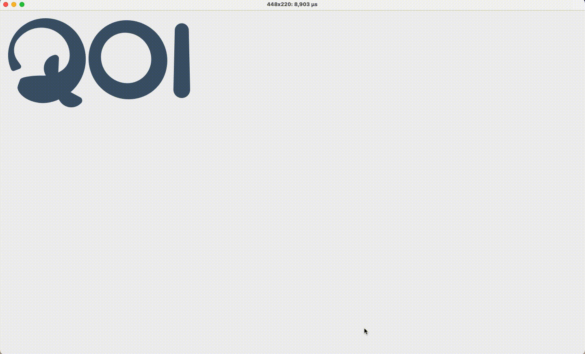

# Xojo_QOI_Decoder

This is a Xojo wrapper around the [reference C implementation](https://github.com/phoboslab/qoi) of the [Quite OK Image Format](https://qoiformat.org/). Using the `qoiconv.c` I built a dylib that also gives it PNG conversion capabilities. It is included here, but you can also compile your own. It requires the [stb image library](https://github.com/nothings/stb). On Mac OS X you can compile it with:

```bash
gcc -g -c qoiconv.c -std=c99 -O3 -o qoiconv.o -I../stb/
gcc -dynamiclib -flat_namespace qoiconv.o -o qoi.dylib     
```

## INSTALLATION

You need to copy `qoi.dylib` to `/usr/local/lib` – that's where the app expects it to reside:

```bash
cp qoi.dylib /usr/local/lib/
```

When first opening the source code and compiling it, Xojo might complain it can't find the .qoi files. Delete the links in the sidebar, and drag'n'drop the .qoi files from the Finder to the sidebar again.

This sample app implements `decode(mb As MemoryBlock)` and `decodeFile(fp As String)`. The app itself cycles between 5 .qoi images, displaying the time it took to decode them, and convert them to a Xojo `Picture` object.



The newest version adds a higher-definition image, and saves the .qoi files as PNG in the `/tmp/` directory.

